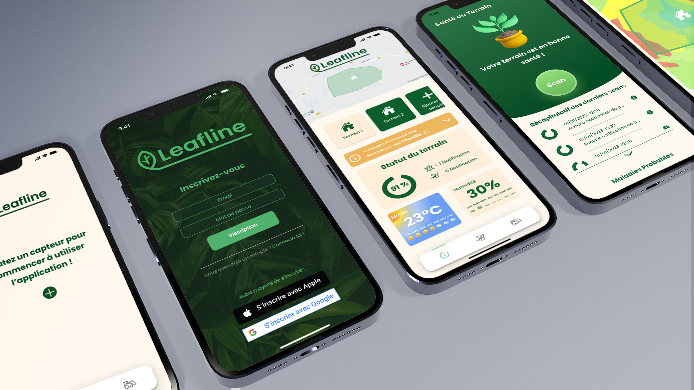

# Leafline 🌱

<div align="center" style="text-align: center;">
  
</div>

## Description 🔬

Leafline est une application utilisant l'IA et des capteurs IoT pour protéger les plantes en prévisualisant la météo. Les capteurs surveillent en temps réel l'humidité du sol, la température et l'intensité lumineuse. L'application analyse les données et les prévisions météorologiques pour avertir les utilisateurs des risques encourus par leurs plantes, tels que les maladies causées par la pluie. Des notifications et des conseils personnalisés sont fournis pour prendre des mesures préventives et préserver la santé des plantes.

## Checklist des fonctionnalités 📝

- Navigation (CustomTabBar) : ✔️
- Map : ❌
- Inscription et connexion : ❌
- Home : ❌
- Dashboard : ❌
- Settings : ❌

## Technologies 🛠

Les technologies suivantes ont été utilisées dans le développement de ce projet :

### Frontend 💻

- [React Native](https://reactnative.dev/) 
- [Expo](https://expo.dev/) 
- [Jest](https://jestjs.io/) 
- [React Test Renderer](https://reactjs.org/docs/test-renderer.html) 

## Normes de convention 📏

**Suivis de développement sur Jira Atlassian**

> _https://farming4cast.atlassian.net/jira/software/projects/LEAFLINE/boards/1_

- Tests
- Convention Atomic Design
- Pascal case
- Snake case
- Camel case

## Démarrer le projet 🚀

Pour démarrer le projet, suivez les étapes ci-dessous :

1. Installez Expo Go sur votre téléphone.
2. Inscrivez-vous sur Expo Go.
3. Exécutez la commande suivante dans votre terminal pour vous connecter à Expo :

```bash
npx expo login
```

4. Pour démarrer le projet, exécutez la commande suivante :

```bash
npx expo start
```

5. Une fois la commande exécutée, vous verrez un code QR s'afficher dans votre terminal et une interface web Expo s'ouvrira dans votre navigateur.
6. Scannez le code QR à l'aide de l'application Expo Go sur votre téléphone ou utilisez l'option "Run on Android device/emulator" ou "Run on iOS simulator" dans l'interface web Expo pour démarrer l'application sur votre appareil.
7. Si vous vous êtes connecté à Expo, vous pouvez aussi déjà voir le projet dans l'application Expo Go !.

Enjoy !

## Running Tests 🧪

Pour lancer les tests, utiliser cette commande

```bash
  npm test
```
